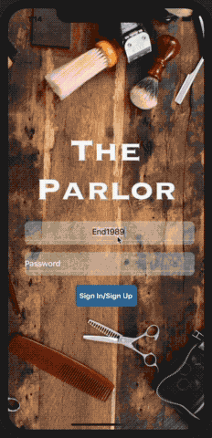

# parlorfrontend

MVP - App for hairstylist to have profiles - photos - reviews - schedule
Project Description

An app that connects the hair stylist with potential clients. Informs clients on their specialties and allows clients to leave reviews and post photos. 

Problem Statement
Current reviews for hair salons are normally vague and about the establishment as a whole, not the individual hair stylist. Hair stylist are what you should shop for when looking for a haircut.

How will it solve this problem
My app will allow stylists who work freelance or for a specific salon to create an online store front and to advertise their work. Clients will be able to read reviews and see photos of hair that the stylist has cut in the past in order to select/request the stylist who best fits their needs. 

User Stories (As a user I would like to...)
Be able to sign up for an account. (As a Stylist & Client)
Be able to log into my account.
Update account information. (Location, specialties, schedule)
Share my profile URL.
Add comments.
Update schedule
Book appointments. 

Technologies
HTML, CSS, Javascript, MongoDB, Mongoose, React-Native, Meteor, Node.js, EJS

 
